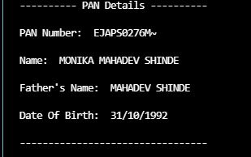

# PAN Card OCR using Pytesseract and OpenCV

This project utilizes Pytesseract and OpenCV to perform Optical Character Recognition (OCR) on PAN card images. The system is designed to extract essential information such as PAN number, Name, Father's Name, and Date of Birth (DOB) from the provided PAN card images.

# Features
Extracts PAN number, Name, Father's Name, and DOB from PAN card images

Utilizes Pytesseract for OCR functionality

Implements OpenCV for image processing tasks

Provides easy integration and usage
 


## Requirements

pip install pillow

pip install ftfy

pip install io

pip install pytesseract

pip install numpy


  
## Run Locally

Clone the project

```bash
  git clone https://link-to-project
```

Go to the project directory

```bash
  cd PAN_card_OCR
```

Install dependencies

```bash
  install above packages
```

Run main file

```bash
  python main.py
```

  
## Screenshots
Query Image


Result Image




  
